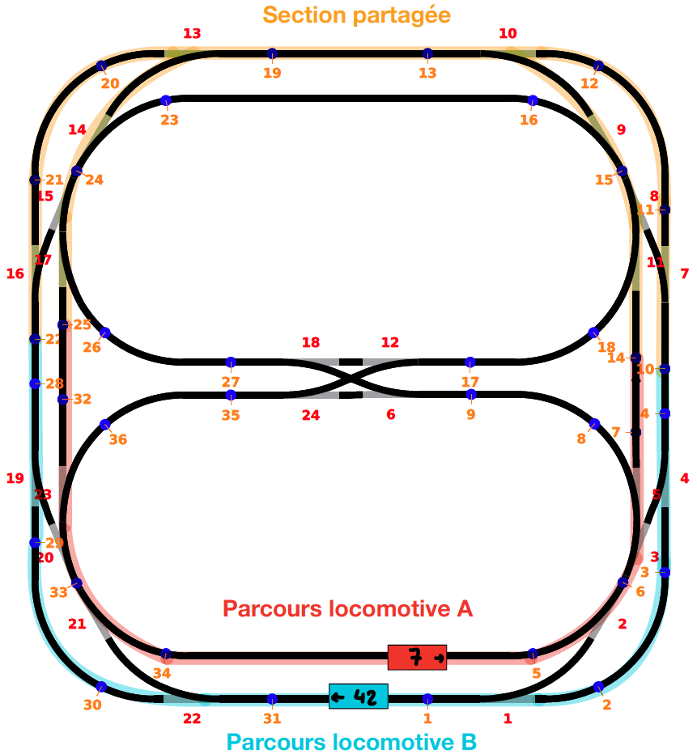
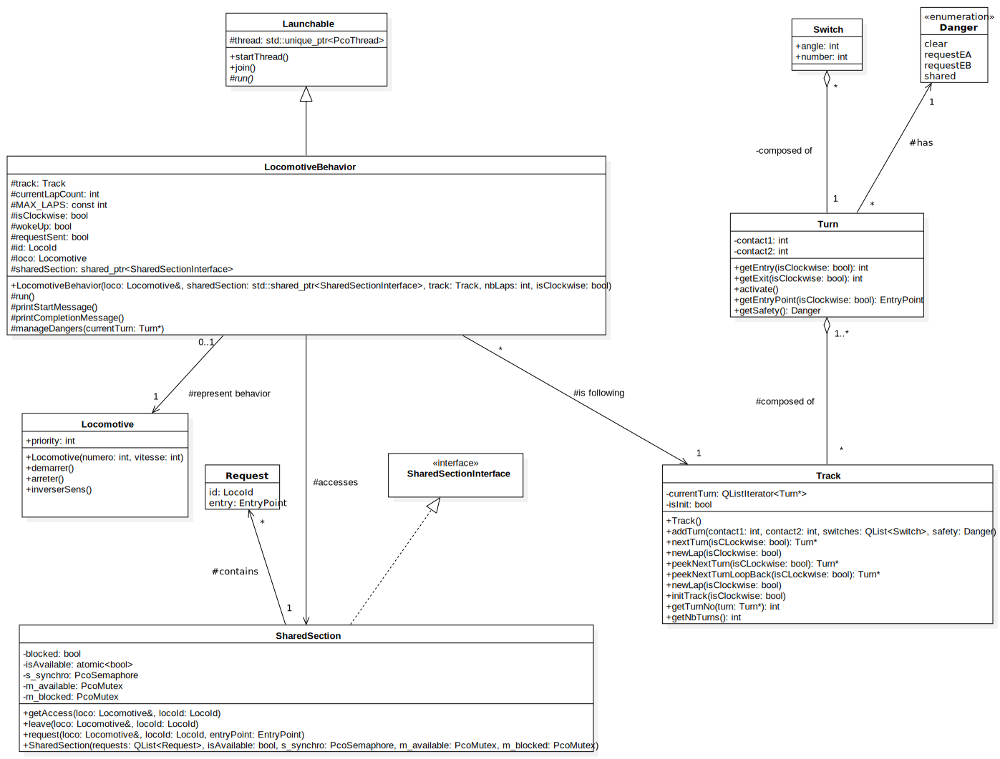

% Rapport labo 4 – Gestion de ressources
% Jeanrenaud Nelson; Mirabile Théo
% Cours de PCO, HEIG-VD 2021

---

# Introduction et but

Le but de ce laboratoire est de réaliser un programme concurrent avec gestion de ressources partagées. De plus, on introduit une notion de priorité des threads. Dans les faits, nous disposons d'une maquette de train et de deux locomotives, le but étant de leur faire effectuer deux trajets circulaires indépendants, mais avec un tronçon commun aux deux. Il faut donc gérer l'accès concurrent à ce tronçon en évitant si possible les dégâts.

\pagebreak

# Section partagée

## Schéma



## Description

Pour ce laboratoire, nous avons choisi une section partagée telle qu'indiquée ci-dessous. La taille est volontairement supérieure au tronçon effectivement commun pour éviter tout problème dû à l'inertie des locomotives.

- Pour la locomotive A (rouge), la section partagée commence au contact n°25 et se termine au contact n°14.

- Pour la locomotive B (bleue), la section partagée commence au contact n°22 et se termine au contact n°10.

\pagebreak

# Descriptif de l'implémentation

## Modélisation UML



## Décomposition en virages (classe `Turn`)

Afin de simplifier notre implémentation, nous avons décidé de décomposer le parcours en virages (classe `Turn`). Un virage est situé entre deux contacts et comporte un ou plusieurs aiguillages (structure `Switch`). Cela permet de faire en sorte d'actionner plusieurs aiguillages à l'entrée ou à la sortie d'un virage.

- Il est possible d'obtenir les contacts d'entrée ou de sortie d'un virage, qui seront différents selon le sens de rotation de la locomotive. En effet, le contact d'entrée d'un virage en rotation horaire sera égal à celui de sortie en rotation anti-horaire, et vice-versa.

- Nous avons également proposé une fonction `activate` qui va avoir pour effet d'actionner tous les aiguillages spécifiés pour ce virage.

- La fonction `getEntryPoint` est utilisé lorsqu'un virage précède une des entrées de la section partagée. Cette fonction permet de retourner l'identifiant du point d'entrée, de type énuméré `EntryPoint`. Ce point d'entrée dàpend à nouveau du sens de rotation, d'où le paramètre `isClockwise`.

- Finalement, la fonction `getSafety` va retourner le niveau de danger du virage, de type énuméré `Danger`. Ce niveau de danger peut être :
  - `clear` si l'on se situe sur un virage n'ayant pas de danger particulier,
  - `requestEA` si l'on se situe sur un virage où il est nécessaire d'effectuer une requête d'accès à la section partagée, avec comme point d'entrée `EA`
  - `requestEB` dans le même cas que précédemment, mais avec comme point d'entrée `EB`,
  - `shared` si l'on se situe sur un virage faisant partie de la section partagée.

## Modélisation d'un parcours (classe `Track`)

Un parcours est composé de plusieurs virages qui se situent dans une liste dédiée. Le fonctionnement général se fait en itérant sur cette liste, de manière croissante dans le cas d'un parcours dans le sens horaire, et de manière décroissante dans le sens inverse. Plus concrètement, à chaque fois que la locomotive avance, elle entre dans un virage par un point d'entrée, et lorsqu'elle en sort par le point de sortie, on itère sur le virage suivant dans la liste, jusqu'à avoir effectué un tour complet.

- Lors de l'initialisation, on peut donc populer notre tour avec des virages en utilisant la fonction

```cpp
addTurn(int contact1, int contact2, QList<Switch> switches, Danger safety)
```

- On peut donc appeler cette fonction autant de fois qu'il y a de virages à ajouter au tour.

- La classe Track fournit également ensemble de méthodes permettant notamment d'itérer entre les virages, plus précisément d'obtenir les propriétés (contacts d'entrée et de sortie, aiguillages à actionner) du virage suivant, d'aller au virage suivant ou encore de recommencer un nouveau tour lorsque celui ci est terminé.

- Il est également possible d'obtenir le numéro du virage courant ainsi que le nombre de virages totaux du tour.

## Implémentation du comportement d'une locomotive (classe `LocomotiveBehavior`)

La classe `LocomotiveBehavior` a été utilisée pour modéliser et implémenter le comportement d'une locomotive. Nous avons déterminé qu'une locomotive dispose d'un parcours (`Track`) à suivre, d'un nombre de tours maximum à effectuer avant de changer de sens, ainsi que d'une section partagée qui est modélisée sous la forme de la classe `SharedSection` qui sera décrite par la suite.

### Paramètres du constructeur

Dans le programme principal, c'est une instance de cette classe qui est lancée par les threads qui représentent chacunes des locomotives. Lors de l'instanciation, les attributs suivants sont renseignés :

- `loco`, une référence vers une instance de la classe `Locomotive` qui est utilisé par le simulateur pour représenter la locomotive en elle même,

- `sharedSection`, un pointeur partagé vers une instance de la classe `SharedSection`, c'est ce qui détermine la section partagée que la locomotive sera amenée à traverser,

- `track`, une référence vers une instance de la classe `Track` qui représente le parcours à effectuer par la locomotive,

- `nbLaps`, le nombre de tours à effectuer avant de faire demi-tour,

- `isClockwise`, un booléen qui détermine si la locomotive circule dans le sens horaire ou anti-horaire,

- `id`, de type énuméré LocoId, qui détermine si la locomotive courante a pour identifiant `LA` ou `LB`.

### Déroulement de l'exécution

Lorsque le programme principal lance les threads, la fonction protégée `run` est lancée. Cette fonction a le déroulement suivant :

- On commence par initialiser la locomotive en allumant ses phares puis en la démarrant.

- Ensuite, on récupère le prochain virage (ou segment de voie comprenant un aiguillage) qui va être traversé, pour attendre sur son contact d'entrée.

- On active ensuite les aiguillages renseignés dans le virage, le cas échéant, afin de laisser la locomotive le traverser correctement.

- On va ensuite récupérer le niveau de danger du virage, afin d'effectuer des actions si nécessaire.

  - Dans le cas où le niveau de danger est `requestEA` ou `requestEB`, cela signifie que l'on va potentiellement entrer dans la section partagée. Cela n'est toutefois pas nécessairement le cas, car on peut également en sortir, et le virage aura tout de même le niveau de danger "request" pour les locomotives qui arriveraient en sens inverse.
  - Si on est donc bel et bien dans le sens correspondant à **l'entrée** dans la section partagée (soit horaire pour le point d'entrée `EA` et anti-horaire pour `EB`), on va donc effectuer une reuqête d'entrée.

- Ensuite, on arrive en sortie de virage, on va donc récupérer le contact de sortie de ce virage et attendre dessus,

- Finalement, avant de sortir du virage, il faut effectuer un accès à la section partagée dans le cas où l'on a fait une requête pour y entrer. C'est à ce moment là que l'on va s'arrêter si la section est occupée, ou continuer à avancer si elle est libre.

Cette exécution se répète pour chaque virage du parcours, jusqu'à ce que l'itération arrive à la fin de la liste. À ce moment là, on incrémente le nombre de tours effectués et on recommence du début. Si on a effectué antant de tour que `MAX_LAPS`, on change de sens et on reprend le parcours dans le sens inverse.

## Implémentation de la section partagée (Classe `SharedSection`)

La classe `SharedSection`, comme expliqué précédemment, est utilisée pour implémenter la section partagée. En se basant sur l'interface fournim nous avons décidé d'utiliser une `QList` pour stocker les différentes requêtes émises par les locomotives. Cela nous a semblé être un choix judicieux par rapport à un tableau de taille fixe, dans le cas où l'on souhaiterait augmenter le nombre de locomotives, ce qui augmentrait le nombre de requêtes possibles à la fois. La section partagée dispose également d'un attribut partagé `isAvailable` qui permet à toutes les locomotives de connaître l'état d'occupation de la section partagée. Cette variable étant partagée entre toutes les locomotives (et donc tous les threads), l'utilisation d'un mutex pour l'exclusion mutuelle s'est révélée nécessaire.

La section partagée dispose également d'un sémaphore permettant la synchronisation des locomotives, ainsi qu'une autre variable booléenne partagée (et donc à protéger) nommée `blocked`, qui permet à une locomotive de savoir s'il y a une autre locomotive en attente lorsqu'elle sort de la section critique, de sorte à libérer ou non le sémaphore de synchronisation.

### Instanciation

Lorsque l'on instancie la classe `LocomotiveBehavior` décrite précédemment, on doit également instancier `SharedSection` afin de gérer l'accès à la section partagée. C'est `LocomotiveBehavior` qui se chargera d'appeler les fonctions de `SharedSection` aux contacts nécessaires, cette classe n'a donc aucune information quant au positionnement de la section partagée.

### Variables privées

Lorsqu'elle est initialisée, cette classe va mettre en place les ressources suivantes :

- Une structure `Request`, qui contient l'identifiant de la locomotive émettrice (de type énuméré `LocoId`) ainsi que le point d'entrée par lequel elle souhaite accéder (de type énuméré `EntryPoint`). Cette structure permet de modéliser les requêtes.

- Une `QList` de requêtes. Cette liste sera populée et vidée à mesure que des requêtes sont effectuées ou traitées.

- Une variable booléenne partagée `blocked`. Cette variable est utilisée par les différentes instances de `LocomotiveBehavior` pour déterminer si une locomotive est actuellement en attente (bloquée après un `acquire`).

- Une variable booléenne atomique `isAvailable`. Cette variable ette variable est utilisée par les différentes instances de `LocomotiveBehavior` pour déterminer si la section critique est libre d'accès ou occupée.

- Un sémaphore `s_synchro` pour la synchronisation

- Deux mutex `m_available` et `m_blocked` pour protéger les variables partagées

### Envoi d'une requête (méthode `request`)

L'envoi d'une requête est relativement simple. Un appel à cette fonction va ajouter une requête à la liste correspondante, avec l'identifiant de la locomotive et le point d'entrée duquel elle souhaite accéder.

### Accès à la section partagée (méthode `getAccess`)

- On commence par vérifier si la section partagée est occupée.

  - Si c'est le cas, la locomotive s'arrête et la variable `blocked` est activée pour signaler que la locomotive est en attente. Ensuite, on _acquire_ le sémaphore `s_synchro`.

  - Lorsque le sémaphore est relâché, la locomotive peut redémarrer.

- On va ensuite récupérer notre requête précédemment effectuée dans la liste, puis on va vérifier s'il n'y a pas d'autres requêtes qui ont été effectuées. Si c'est le cas, on va vérifier l'identifiant de la locomotive émettrice.

  - S'il s'agit de la locomotive `LA` et qu'elle souhaite accéder depuis un autre point d'entrée que le nôtre, elle sera prioritaire. On va donc rendre la section partagée disponible en activant `isAvailable`, puis s'arrêter. Après relâchement du sémaphore, on peut repartir et prendre la main.

  - Le cas est similaire s'il s'agit de la locomotive `LB` et qu'elle vient du même point d'entrée que nous.

- Si aucune autre requête n'a été faite, nous sommes les seuls à vouloir accéder, la voie est libre.

- Après avoir accédé à la section partagée, on retire notre requête de la liste.

### Sortie de la section partagée (méthode `leave`)

Lorsqu'une locomotive sort de la section partagée, elle la rend à nouveau disponible en activant `isAvailable`, puis elle débloque une éventuelle locomotive en attente en relâchant le sémaphore si la variable `blocked` est activée.

# Scénarios de test

Pour valider le fonctionnement, nous avons essayé plusieurs vitesses de départ, ainsi que de mettre en pause les locomotives individuellement.

Le premier programme demandé n'a pas posé de problème majeur. Cependant, le deuxième programme avec notions de priorités peut poser des problèmes d'interbloquage ou de collision des locomotives dans certains cas, notamment lorsque l'on change de sens et que la vitesse des locomotives est fortement différente. Nous pensons qu'il s'agit d'un problème lié aux requêtes qui sont effectuées une première fois par une locomotive avant de changer de sens, ce qui laisse une requête "fantôme" en suspens et bloque complètement les locomotives. Ou dans le cas d'une collision, cela peut venir du fait que la requête est passée au moment exact où l'autre locomotive quitte la section critique (ou vice-versa), ce qui peut amener une requête a être acceptée alors que la section critique est déjà occupée.

# Conclusion

Ce laboratoire s'est avéré assez complexe et long à réaliser. La découverte du simulateur a nécessité un certain temps, ainsi que la façon d'organiser le code et de décomposer le problème. Au final, notre programme nous satisfait dans sa sa conception et sa documentation, mais il reste des problèmes que nous ne sommes pas parvenus à résoudre par manque de temps.
